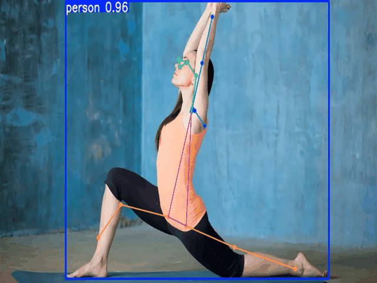

# Yoga Pose Estimation with YOLO



This project focuses on training and evaluating a YOLO (You Only Look Once) model for yoga pose estimation. It utilizes the Ultralytics framework to streamline the training and validation process.

## Table of Contents

- [Yoga Pose Estimation with YOLO](#yoga-pose-estimation-with-yolo)
  - [Table of Contents](#table-of-contents)
  - [Features](#features)
  - [Project Structure](#project-structure)
  - [Getting Started](#getting-started)
    - [Prerequisites](#prerequisites)
    - [Installation](#installation)
  - [Dataset](#dataset)
  - [Usage](#usage)
    - [Training](#training)
    - [Testing](#testing)
  - [Linting and Formatting](#linting-and-formatting)
  - [References](#references)

## Features

- Train a YOLO pose estimation model on a custom dataset.
- Evaluate the performance of the trained model.
- Command-line interface for easy execution of training and testing scripts.
- Modern Python project setup using `uv`.
- Pre-configured with `pre-commit` hooks for maintaining code quality.

## Project Structure

```
.
├── datasets/                 # Directory for image and label data
│   ├── data.yaml             # Dataset configuration file
│   ├── train/
│   ├── valid/
│   └── test/
├── models/                   # Directory for pre-trained models
├── output/                   # Directory for training outputs (weights, plots, etc.)
├── prediction_output/        # Directory for testing/validation outputs
├── .pre-commit-config.yaml   # Configuration for pre-commit hooks
├── constants.py              # Defines constant paths for the project
├── README.md                 # This README file
├── testing_model.py          # Script for testing the trained model
├── train.py                  # Script for training the model
└── uv.lock                   # Pinned dependencies for reproducible environment
```

## Getting Started

Follow these instructions to get a copy of the project up and running on your local machine for development and testing purposes.

### Prerequisites

- Python 3.13+
- uv - An extremely fast Python package installer and resolver.
- (Recommended) An NVIDIA GPU with CUDA for faster training.

### Installation

1. **Clone the repository:**

   ```bash
   git clone https://github.com/vivekpatel99/yoga-pose-estimation.git
   cd yoga-pose-estimation
   ```

2. **Create a virtual environment and install dependencies:**
   Using `uv`, you can create a virtual environment and install the required packages. The `.[dev]` extra includes development tools like `pre-commit`.

   ```bash
   uv sync
   ```

## Dataset

This project is configured to work with datasets in the YOLO format. The expected structure is:

- An `images` directory containing your image files.
- A `labels` directory containing `.txt` files with annotations for each image.
- A `data.yaml` file that defines the paths to the training, validation, and test sets, number of classes, and class names.

An example `data.yaml` might look like this:

```yaml
# datasets/data.yaml
train: ../datasets/train/images
val: ../datasets/valid/images
test: ../datasets/test/images

# number of classes
nc: 5 # e.g., 5 different yoga poses

# class names
names: ['downdog', 'goddess', 'plank', 'tree', 'warrior2']
```

The dataset used for initial training can be found on Roboflow.

## Usage

The project includes scripts for training and testing the model.

### Training

The `train.py` script handles model training. You can specify the model, dataset, epochs, and other parameters via command-line arguments.

**Example:**

```bash
uv run train.py \
    --model-path models/yolov8n-pose.pt \
    --dataset-path datasets/data.yaml \
    --epochs 100 \
    --imgsz 640 \
    --batch-size 8 \
    --output-path output
```

### Testing

The `testing_model.py` script is used to evaluate the trained model on a test set.

**Example:**

```bash
uv run testing_model.py \
    --model-path output/train/weights/best.pt \
    --dataset-path datasets/data.yaml \
    --output-path prediction_output
```

## Linting and Formatting

This project uses `pre-commit` hooks to ensure code quality and consistency. To set it up, run:

```bash
pre-commit install
```

Now, the configured hooks (including `ruff` for linting/formatting and `codespell` for spell checking) will run automatically before each commit.

You can also run the hooks manually on all files:

```bash
pre-commit run --all-files
```

## References

- [Dataset Source](https://universe.roboflow.com/waste-segregation-image-dataset/dataset-ridimensionato-wvu77/dataset/1)
- [Ultralytics Pose Estimation Docs](https://docs.ultralytics.com/tasks/pose/)
